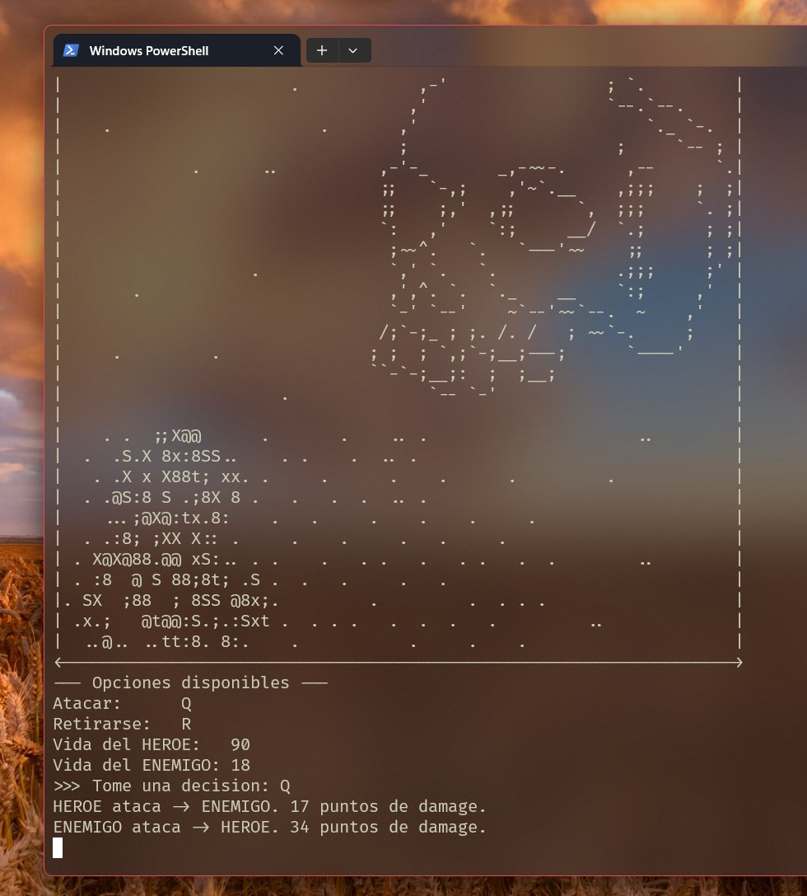

## Important
Gotta mention that for the run of this code it's necesary to install the GNU Linux C/C++ compiler (MinGW) in order to compile the game.
Run the command:

```gcc main.c combat.c functions.c animations.c -o game.exe```

so you can compile it into an executable file.

## Update after a while (Aug 31, 2024)
I was really newbie at the moment so, I really didn't knew about CMake like... at all?

---
## Thogths from Oct 24, 2025 (like a year later)
I can't even understand how I made this, so proud of myself haha. Well made, funny, even not even knowing how to do a single thing, I went for it and made a game with almost no knowledge. The intro is priceless. There are quite a few easter eggs, cute experience.

Btw, I added a `game.exe` compiled file, if you can't compile it. Remember, _gcc_ and stuff have to be installed.

---
## Screenshot


